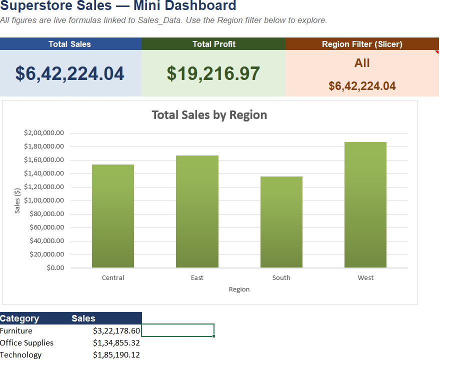

# Superstore Sales Analysis using Excel

## 📊 Project Overview

This project analyzes Superstore sales data using Microsoft Excel.

The objective is to understand sales performance, customer segments,
product performance, regional performance, and profitability.

## 🛠️ Tools Used

- Microsoft Excel
- Pivot Tables
- Pivot Charts
- Excel Formulas
- Data Cleaning
- Data Analysis
- Dashboard

## 📁 Dataset

The dataset contains information including:

- Order ID
- Order Date
- Ship Date
- Ship Mode
- Customer Name
- Segment
- Region
- State
- City
- Category
- Sub-Category
- Product Name
- Quantity
- Discount
- Sales
- Profit

## 🔍 Analysis Performed

The project includes:

- Sales by Region
- Sales by Category
- Sales by Sub-Category
- Sales by Segment
- Sales Trends
- Product Performance
- Customer Analysis
- Profit Analysis
- Discount Analysis

## 📈 Dashboard

The Excel dashboard provides a visual summary of sales and
business performance.

## 💡 Key Insights

- Analyzed sales performance across different regions.
- Compared different product categories and sub-categories.
- Analyzed customer segments.
- Studied sales trends over time.
- Examined the relationship between sales, discounts, and profit.

## 📂 Project File

The complete Excel analysis workbook is available in this repository:

Superstore_Sales_Analysis.xlsx

## 👩‍💻 Author

*Shaik Fathima*
